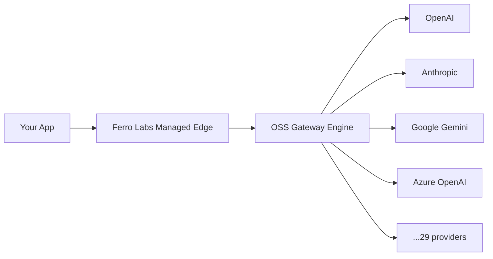

# Ferro Labs Managed — Managed AI Gateway

Ferro Labs Managed is the managed, multi-tenant, hosted version of the Ferro Labs AI Gateway. Built on the same open-source engine that powers the self-hosted gateway, Ferro Labs Managed adds isolated tenant instances, a full-featured dashboard, usage-based billing, semantic caching, SSO/SAML, and enterprise security plugins — all operated by Ferro Labs so you never touch infrastructure.

## Architecture

Every request flows through the Ferro Labs Managed edge layer — which handles authentication, tenant isolation, rate limiting, and billing — before reaching the same open-source gateway engine used by self-hosted deployments. The engine then routes to the configured AI provider.

## What's available today

The open-source AI Gateway is fully available for self-hosting. Ferro Labs Managed plans and pricing are coming soon.

:::info Coming soon
Ferro Labs Managed pricing, plans, and feature tiers will be announced when the platform exits early access. [Join the waitlist](https://www.ferrolabs.ai/) to be notified.
:::

## How Ferro Labs Managed Differs from Self-Hosting

1. **Zero ops** — No servers to provision, no containers to update, no TLS certificates to rotate. Ferro Labs handles uptime, scaling, and upgrades.
2. **Durable billing** — Built-in usage metering, spend tracking, and budget enforcement per team or project. No need to wire up your own billing pipeline.
3. **Enterprise plugins** — Five additional plugins (PII redaction, prompt injection detection, content moderation, guardrails, and data-loss prevention) are available exclusively on Ferro Labs Managed Pro and Enterprise plans.
4. **Team management** — Invite teammates, assign roles, and scope API keys to projects — all from the dashboard.

## Join the Waitlist

Ferro Labs Managed is currently in early access. Sign up to get notified when your plan is available.

[**Join the waitlist**](https://www.ferrolabs.ai/)

## Related pages

- [OSS vs Ferro Labs Managed](/guides/oss-vs-ferrocloud)
- [Semantic cache](/ferrocloud/semantic-cache)
- [Enterprise features](/enterprise)
