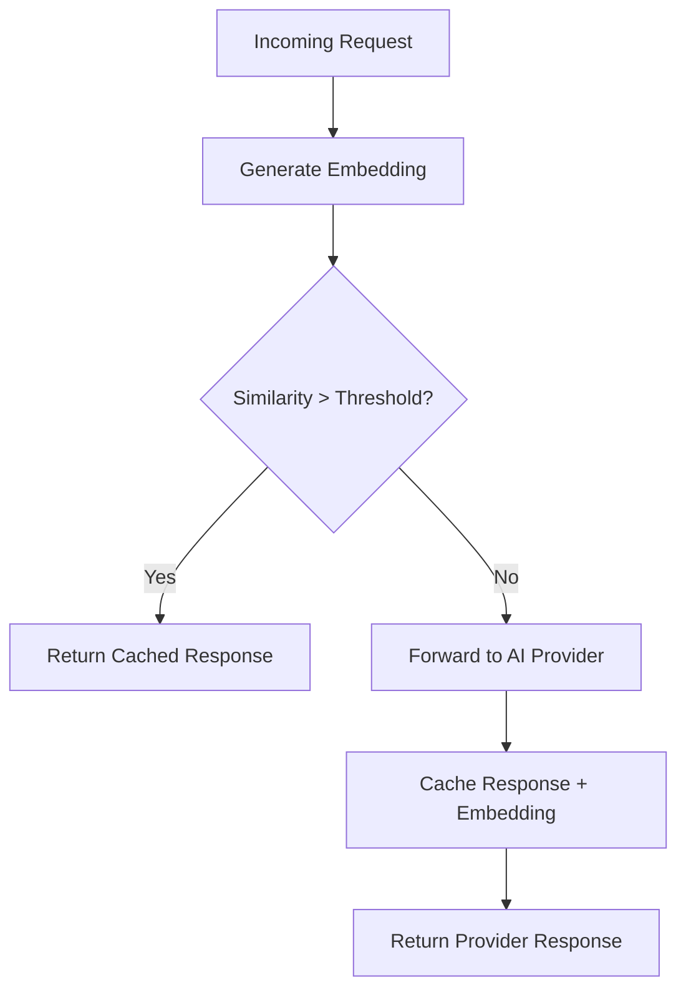

# Semantic Caching

## The Problem with Exact-Match Caching

Traditional caches key on the exact request body. That means two queries asking the same thing in slightly different words — "What's the weather?" versus "Tell me the weather" — produce separate cache misses and separate billable calls to the upstream provider.

Semantic caching solves this by comparing the **meaning** of the query, not its literal text.

## How It Works

1. **Embed the query** — The incoming prompt is passed through a lightweight embedding model to produce a dense vector.
2. **Similarity search** — The vector is compared against cached entries using an HNSW index in PostgreSQL with pgvector.
3. **Serve or forward** — If a cached entry exceeds the similarity threshold, the cached response is returned immediately. Otherwise the request is forwarded to the AI provider and the response is cached for future hits.

## Configuration Options

| Option | Type | Default | Description |
|---|---|---|---|
| `similarity_threshold` | `float` | `0.92` | Minimum cosine similarity (0.0 – 1.0) required to treat a cached entry as a hit. Higher values are stricter. |
| `ttl_seconds` | `int` | `3600` | Time-to-live for cached entries in seconds. Expired entries are evicted on the next write cycle. |
| `vector_dimensions` | `int` | `1536` | Dimensionality of the embedding vectors. Must match the embedding model output. |
| `embedding_model` | `string` | `text-embedding-3-small` | The model used to generate query embeddings. |

## Cost Savings

Semantic caching directly reduces the number of billable tokens sent to upstream providers.

**Example:** If 30 % of your queries are semantically similar and you serve 10,000 requests per day, that is 3,000 cached responses. At an average cost of $0.002 per request, you save approximately **$6 per day** — or roughly **$180 per month** — without any change to your application code.

Actual savings depend on your traffic patterns, similarity threshold, and the cost of the models you use.

:::note Ferro Labs Managed Feature
Semantic caching is available on the **Pro** plan and above. It is not included in the open-source gateway or the Community and Starter plans.

[**Join the waitlist**](https://www.ferrolabs.ai/) to get access.
:::

## Related Pages

- [Ferro Labs Managed overview](/ferrocloud/overview)
- [OSS vs Ferro Labs Managed](/guides/oss-vs-ferrocloud)
- [Plugins](/guides/plugins)
